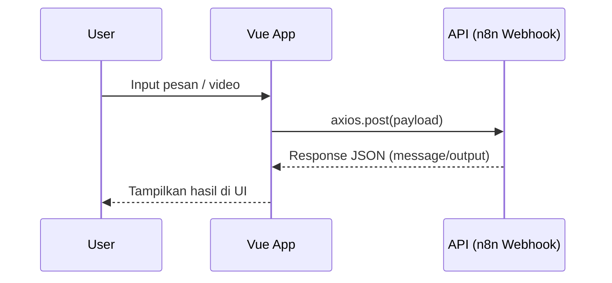

## 🔗 Bagian API — Koneksi Frontend dengan Backend

Pada bagian ini, kita menggunakan **Axios** untuk mengirim data dari aplikasi Vue ke server (Webhook n8n).

### 📌 Apa itu Axios?

> **Axios** adalah library JavaScript yang digunakan untuk melakukan permintaan **HTTP** (GET, POST, PUT, DELETE) ke API atau server lainnya.
> Bisa digunakan di browser maupun Node.js.

Axios membantu:

* Mengirim data ke server
* Menerima response JSON
* Menangani error secara mudah
* Mendukung async/await ✨

---

### 📦 Install Axios

Sebelum menggunakan API ini, pastikan axios sudah ter-install:

```bash
npm install axios
```

---

## 📌 `api.js` — API Service Layer

Berikut fungsi lengkap untuk menghubungkan aplikasi dengan server webhook:

```js
import axios from 'axios'

const BASE_URL = 'https://faishalfhid.app.n8n.cloud/webhook'

// === Kirim pesan text ke bot ===
export async function sendMessage(text) {
  try {
    const response = await axios.post(`${BASE_URL}/input-message`, { text })

    if (response.data?.output) {
      return response.data.output
    }

    console.warn('Response tidak sesuai:', response.data)
    return '⚠️ Maaf, tidak ada respons dari bot.'
  } catch (error) {
    console.error('Error saat kirim pesan:', error)
    return '⚠️ Maaf, terjadi kesalahan koneksi.'
  }
}

// === Kirim data video (URL + title) ===
export async function submitVideo(URL, title) {
  try {
    const response = await axios.post(`${BASE_URL}/submit-video`, {
      URL,
      title
    })

    if (response.data?.output) {
      return response.data.output
    }

    console.warn('Response tidak sesuai:', response.data)
    return '⚠️ Maaf, respons API tidak valid.'
  } catch (error) {
    console.error('Error saat submit video:', error)
    return '⚠️ Maaf, terjadi kesalahan koneksi.'
  }
}
```

---

## 🧩 Penjelasan kode — Step by Step

| Bagian Kode                               | Penjelasan                                                         |
| ----------------------------------------- | ------------------------------------------------------------------ |
| `import axios from 'axios'`               | Mengimpor axios agar bisa melakukan HTTP request                   |
| `const BASE_URL = '.../webhook'`          | URL dasar server API yang menerima data dari frontend              |
| `export async function sendMessage(text)` | Fungsi untuk mengirim **pesan teks** ke bot                        |
| `axios.post()`                            | Mengirim request HTTP POST ke server dengan payload                |
| `response.data?.message`                  | Mengecek apakah server mengirim field response bernama `message`   |
| `console.warn()`                          | Log jika server mengirim struktur response tidak sesuai            |
| `submitVideo(url, title)`                 | Fungsi API tambahan untuk mengirim **URL video + judul** ke server |
| Error handling → `try...catch`            | Menampilkan pesan error yang ramah user jika koneksi gagal         |

---

## 🧠 Alur Kerja API

1️⃣ User memasukkan pesan atau data video
2️⃣ Frontend memanggil `sendMessage()` atau `submitVideo()`
3️⃣ Axios → mengirim request POST ke Webhook n8n
4️⃣ Server memproses data
5️⃣ Frontend menampilkan hasil ke user

📌 Sequence Diagram (Markdown mermaid, bisa di-render di GitHub)



---

## ⚠️ Penanganan Error

Jika:

* Koneksi server gagal
* Response tidak sesuai
* Proses webhook bermasalah

Maka fungsi mengembalikan pesan fallback:

> "⚠️ Maaf, terjadi kesalahan koneksi."

Sehingga UI tetap menampilkan informasi ke user dan tidak crash.

---

## 🎯 Kesimpulan

* **Axios** digunakan untuk mengirim data dari frontend ke webhook n8n
* Terdapat dua fungsi API:

  * `sendMessage()` → kirim chat teks
  * `submitVideo()` → kirim judul + URL video
* Sudah menggunakan **async/await** dan **error handling** lengkap

---

Kalau kamu ingin, saya bisa lanjut:

✔ Menambahkan dokumentasi **App.vue** dengan integrasi API
✔ Menambahkan section **troubleshooting & testing API**
✔ Menambahkan **parameter & contoh payload** untuk backend developer

Mau saya gabungkan semuanya jadi **README final rapi** siap upload GitHub?
